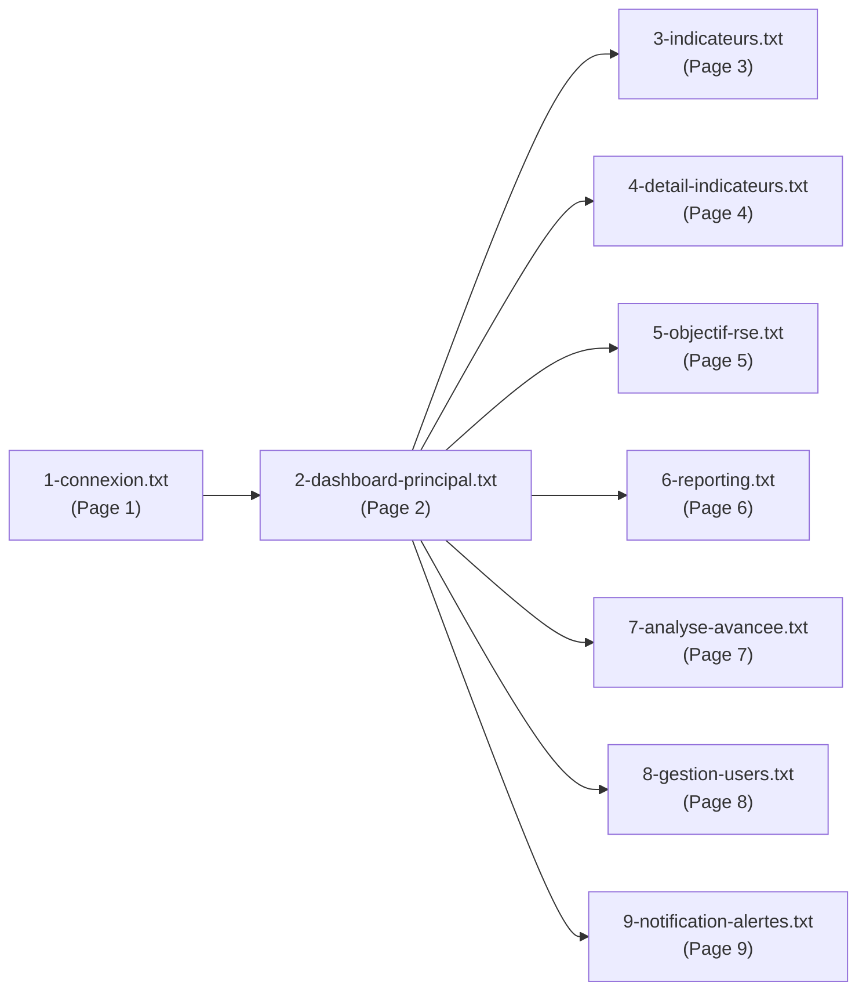

# Guide des maquettes 2iE ESG Manager

Ce dossier contient les scripts HTML des maquettes pour le projet 2iE ESG Manager. Chaque fichier txt représente une page de l'application.

## Fichiers contenus

1. `1-connexion.txt` - Page de connexion
2. `2-dashboard-principal.txt` - Dashboard principal
3. `3-indicateurs.txt` - Gestion des indicateurs
4. `4-detail-indicateurs.txt` - Détail de l'indicateur
5. `5-objectif-rse.txt` - Gestion des objectifs RSE
6. `6-reporting.txt` - Reporting
7. `7-analyse-avancee.txt` - Analyse avancée
8. `8-gestion-users.txt` - Gestion des utilisateurs
9. `9-notification-alertes.txt` - Notifications et alertes

## Instructions

- Ouvrez chaque fichier `.txt` pour voir le code HTML complet de la maquette.
- Le code est prêt à être utilisé pour le rendu de prototypes.

## Utilisation

1. Ouvrez `README.md` pour consulter la liste des pages.
2. Ouvrez le fichier texte correspondant à la page voulue.
3. Copiez le code dans un éditeur HTML ou importez-le dans votre projet.

## Workflow du projet

